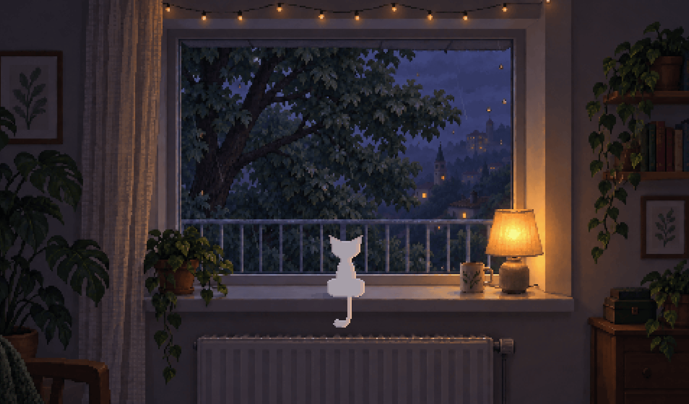

# Nooktown



A calm lofi vibe mixer with lofi beats, rain sounds and white noise to study, sleep and unwind. A black cat sits on a rooftop ledge above a quiet hillside town, or on the sill of a big window looking out at a tree, while the music, rain and vinyl crackle are synthesized live in your browser. Pick the place, the weather and the time of day, then mix it your way.

Try it at https://nooktown.mogita.rocks, or add it to your home screen to use it like an app.

## Features

- Two places, a rooftop and a room by the window, each with twelve pixel art scenes: rainy, cloudy, sunny or snowy, by day, evening or night, with dithered transitions, rain, glowing lights and fireflies.
- Live Web Audio music: electric piano, bass and dusty drums with tape wobble. The chords change with the time of day and the place.
- Ambience that follows the scene: rain, wind or breeze; birds, chimes or crickets; vinyl crackle. Indoors the window muffles the outside.
- A turntable brake and spin-up when you pause and play.
- In 38 languages, following your browser's until you pick one in the mixer.
- Remembers your mix, and works offline once installed.

## Development

```sh
npm install
npm run dev
```

Open http://localhost:5173. Run `npm run dev -- --host` to test on a phone on the same network. The audio check lives at http://localhost:5173/tests/audio.html and prints PASS or FAIL. Run `npm test` to check that the cat's tail never breaks apart and that every language translates every text.

## Art

The scenes were generated with Codex and snapped to their true pixel grid. The snapper needs numpy and Pillow.

```sh
sh art/variants.sh
python3 art/snap.py
```

`art/prompt-base.txt` and `art/prompt-room.txt` are the prompts for the rainy day scenes of each place. `art/variants.sh` asks Codex for any missing weather and time variants of them. `art/snap.py` snaps every raw image into `public/assets/` and fixes the ledge reflections, the moon and the bulb wire, then renders the link preview card `public/og.png`.

## Layout

- `src/audio.js`: Web Audio engine (FM electric piano, bass, drums, ambience, tape wow, turntable brake).
- `src/scene.js`: WebGL2 renderer (scene transitions, rain and splashes, glow, fireflies, cloud shadows, the cat, the tab icon).
- `src/main.js`: state, controls and persistence.
- `src/i18n/`: the language list and browser matching, the translation lookup, and one JSON file per language in `locales/`, keyed like `locales/en.json`.
- `public/`: scene art, link preview card, app icons, web manifest, service worker, robots.txt and sitemap.

## Support

If Nooktown keeps you company, you can buy me a coffee.

<a href="https://ko-fi.com/mogita"></a>

## License

MIT © [mogita](https://github.com/mogita)
